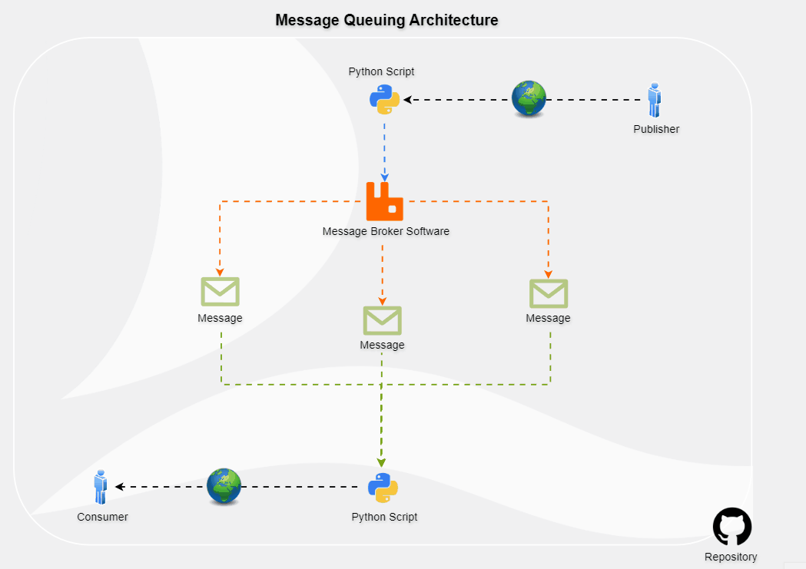
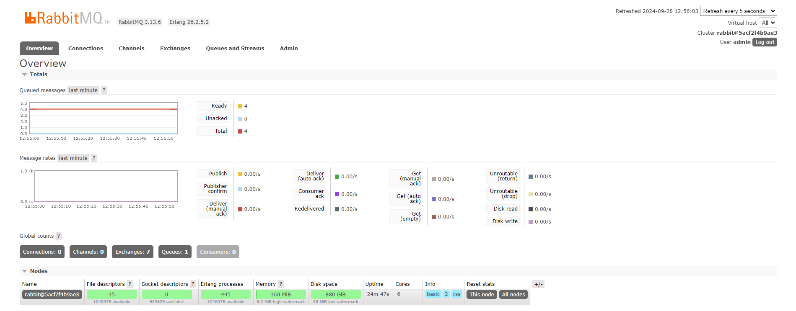

## Overview

This project demonstrates a message queuing system using **RabbitMQ** to manage and visualize message flows between publishers and consumers. The project consists of:

- **Publisher**: A Python script that sends messages to a message broker (RabbitMQ).
- **Consumer**: A Python script that retrieves and processes messages from the queue.
- **RabbitMQ Dashboard**: Provides real-time monitoring and management of messages, enabling easy visualization and control over the message flow.

To make deployment and management easier across different operating systems, the entire RabbitMQ setup has been **Dockerized**.

## Features

- **Message Queuing**: Efficient message exchange between a publisher and consumer.
- **Real-time Monitoring**: Watch live messages and their status via the RabbitMQ dashboard.
- **Data Aggregation**: Aggregated message counts, live data visualization, and applied alerts.
- **Dockerized Setup**: RabbitMQ is containerized, allowing easy deployment and management across different environments.

## Getting Started

### Prerequisites

- Docker
- Python
- Git

### 1. Clone the Repository

```bash
git clone https://github.com/YakirBar/Message-Queuing-Project.git
```

### 2. Run the Message Queuing Manager with Docker

1. Navigate to the Docker directory:
   ```bash
   cd /Message-Queuing-Project/docker
   ```
2. Ensure ports **5672** and **15672** are available.
3. Start the RabbitMQ service:
   ```bash
   docker-compose up -d
   ```
4. Open your browser and access the RabbitMQ Management Dashboard at:
   ```bash
   http://localhost:15672
   ```
5. Log in using the following credentials:
   - **Username**: `admin`
   - **Password**: `secret`
6. Navigate to **Queues and Streams** -> **Hello** -> **Get messages** to monitor the message queue.

### 3. Run the Publisher & Consumer with Python

1. Navigate to the application directory:
   ```bash
   cd /Message-Queuing-Project/app
   ```
2. Install the required Python library:
   ```bash
   pip install pika
   ```
3. Run the **publisher** to send messages:
   ```bash
   python publisher.py
   ```
4. Run the **consumer** to receive and process messages:
   ```bash
   python consumer.py
   ```


## Enjoy!

Now you can effectively manage and monitor message flows between your publisher and consumer using the RabbitMQ dashboard. Watch live messages, count message entries, and set alerts with ease. Feel free to contribute and make this project even better!